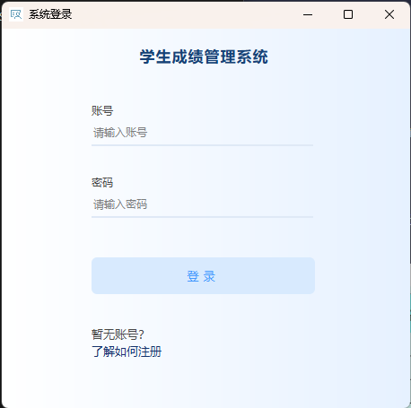
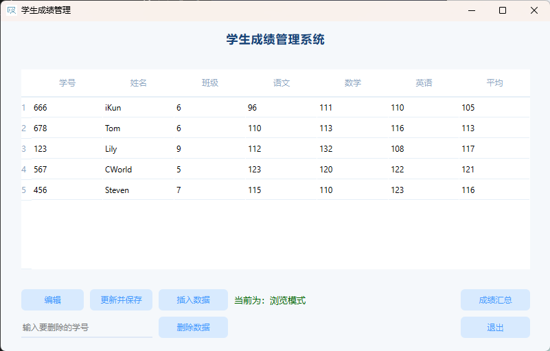
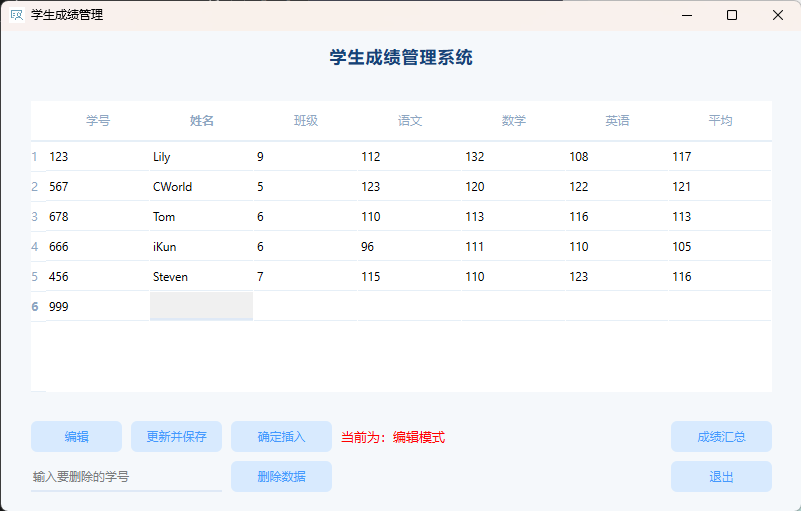
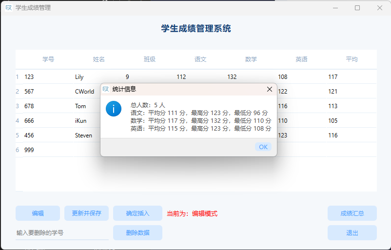
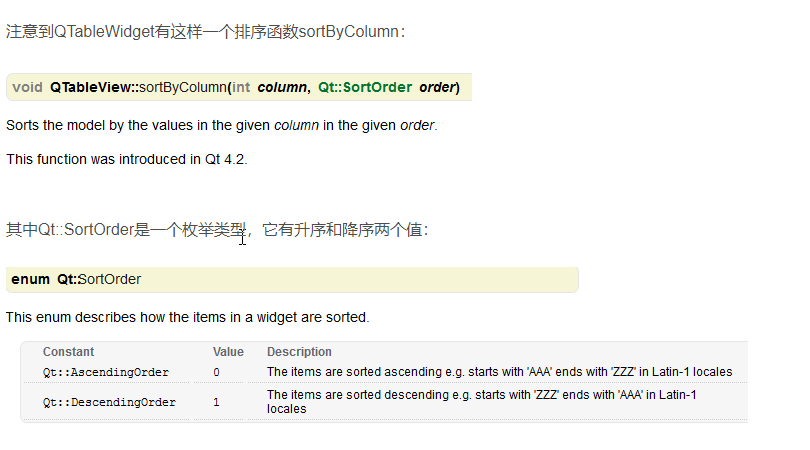

# Student Score System

[](https://github.com/cworld1/stu-score-sys/stargazers)
[](https://github.com/cworld1/stu-score-sys/blob/master/LICENSE)
[](https://github.com/cworld1/stu-score-sys/releases/latest)

这是一个使用 Qt 构建、C++ 作为底层开发的学生成绩管理系统，支持对学生成绩的增删改查、排序、汇总等功能。

## 下载

前往 [Release](https://github.com/cworld1/stu-score-sys/releases/latest) 下载最新版本。

## 构建

### 环境

- Qt 6.4.1
- MinGW 11.2.0 64-bit
- Qt Creator 9.0.1
- Windows 11 Pro 22H2 64-bit

### 构建步骤

1. 打开 Qt Creator，选择 `Open Project`，打开 `stu-score-sys.pro`。
2. 点击 `Projects`，选择 `Build`，在 `Build Steps` 中添加 `qmake`。
3. 点击 `Projects`，选择 `Release`。
4. 点击 `Build`，选择 `Build All`。
5. 打开 Qt 6.4.1，使用 `cd` 命令进入 `build-stu-score-sys-Desktop_Qt_6_4_1_MinGW_64_bit-Release` 目录。
6. 使用 `windeployqt.exe` 命令将依赖文件复制到 `release` 目录下。

## 使用介绍

### 登录

软件第一次使用时，会将输入账号密码加密存储到当前文件夹下（admin.txt）。如需需重新设置账号密码，则把 admin.txt 文本删除即可。



### 管理

1. 编辑&保存：在浏览模式中无法对数据进行编辑，点击编辑按钮即可解锁，此时双击单元格可进行编辑；编辑完成后，点击更新并保存即可。

     

2. 分数排序：点击任意列，将对该列的值进行升序/降序排序。

3. 插入数据：点击插入数据进入插入数据模式，新增一行以便填充数据；输入完毕后，点击确认插入即可。平均分无需填写，会自动生成并展示。

     

4. 删除数据：输入要删除的学号，点击删除数据即可删除对应行数据。

5. 成绩信息汇总：点击成绩汇总，获取各科学生成绩整体信息。

     

6. 退出系统：点击退出即可回退到登录界面。

## SQLite 语句

- 数据表创建：

    ```sql
    create table stu(
            id primary key, 
            name,
            class,
            chinese,
            math,
            english
    );
    ```

- 插入数据：

    ```sql
    insert into stu values('123','小明','高一三班',90,90,90);
    ```

- 排序：

    来自 [Qt 官方技术文档](https://doc.qt.io/qt-5.12/stylesheet-reference.html)

    

## 界面设计

界面的 QSS 设计：

login.ui

```css
/* 主窗口 */
QMainWindow {
    background: qlineargradient(
        spread: pad,
        x1: 0,
        y1: 0,
        x2: 1,
        y2: 0,
        stop: 0 #ffffff,
        stop: 1 #e6f1ff
    );
}
/* 常规提示字体 */
QLabel {
    font-family: "Microsoft YaHei";
    color: #474747;
}
/* 标题 */
QLabel#label_title {
    letter-spacing: 1px;
    color: #164276;
    font-size: 13pt;
    font-weight: bold;
}
/* 输入框 */
QLineEdit {
    font-family: "Microsoft YaHei";
    border: none;
    border-bottom: 2px solid #dfe9f6;
    background: transparent;
}
/* 按钮 */
QPushButton {
    padding: 1px 8px;
    font-family: "Microsoft YaHei";
    border: none;
    border-radius: 6px;
    background-color: #d8eafe;
    color: #4499fe;
}
QPushButton#button_login {
    letter-spacing: 5px;
}
QPushButton:hover,
QPushButton:avtive {
    background-color: #4499fe;
    color: #fff;
}

```

stuscore.ui

```css
/* 主窗口 */
QMainWindow {
    background-color: #f5f8fb;
}

/* 常规提示字体 */
QLabel {
    font-family: "Microsoft YaHei";
    color: #474747;
}
/* 标题 */
QLabel#label_title {
    letter-spacing: 1px;
    color: #164276;
    font-size: 13pt;
    font-weight: bold;
}

/* 表格 */
QTableWidget {
    gridline-color: transparent;
    border-radius: 6px;
}
QHeaderView {
    border: none;
    border-bottom: 1px solid #e6eff7;
    background-color: #ffffff;
}
QHeaderView::section {
    font-family: "Microsoft YaHei";
    color: #8ea6c1;
    background-color: #ffffff;
    border: none;
    border-bottom: 1px solid #e6eff7;
    height: 40px;
}
QTableView QTableCornerButton::section {
    background: #ffffff;
    border: none;
    border-bottom: 2px solid #e6eff7;
}
QTableWidget::item {
    font-family: "Microsoft YaHei";
    border: none;
    border-bottom: 1px solid #e6eff7;
}

/* 按钮 */
QPushButton {
    padding: 1px 8px;
    font-family: "Microsoft YaHei";
    border: none;
    border-radius: 6px;
    background-color: #d8eafe;
    color: #4499fe;
}
QPushButton:hover,
QPushButton:avtive {
    background-color: #4499fe;
    color: #fff;
}

/* 输入框 */
QLineEdit {
    font-family: "Microsoft YaHei";
    border: none;
    border-bottom: 2px solid #dfe9f6;
    background: transparent;
}

```

## 参考

Qt环境搭建及项目运行：

1. [Qt开发环境搭建(win10)](https://www.jianshu.com/p/65bc892829a0)
2. [Qt介绍以及Qt环境安装](https://zhuanlan.zhihu.com/p/158782708)
3. [Qtcreator安装后，构建套件kits中Qt版本为无，且没有qmake](https://blog.csdn.net/sanmenrenjian/article/details/97363667)
4. [Qt零基础系列](https://www.zhihu.com/column/c_1332046859120676864)
5. [QT快速入门 | 最简单最简洁的QT入门教程](https://www.bilibili.com/video/BV1N34y1H7x7/)
6. [GR-805 : DX9 Overlay is DISABLED ERROR](https://forum.qt.io/topic/131194/gr-805-dx9-overlay-is-disabled-error/6)
7. [Qt Quick核心编程](https://zh.annas-archive.org/md5/115de5ba3753bf577bb6d12d2bf9065a)
8. [Qt ——debug调试](https://blog.csdn.net/weixin_45375588/article/details/95059992)
9. [QDebug 输出调试信息](https://blog.csdn.net/amnes1a/article/details/64438778)

数据库创建与维护：

1. [SQL 语法](https://www.runoob.com/sql/sql-syntax.html)
2. [SQLite 创建数据库](https://www.runoob.com/sqlite/sqlite-create-database.html)
3. [Sqlite3 常用命令](https://www.cnblogs.com/momoyan/p/12907222.html)
4. [Qt SQL 6.4.1](https://doc.qt.io/qt-6/qtsql-index.html)
5. [QT应用SQL数据库，简单全面的应用，增删改查](https://blog.csdn.net/qq_36353009/article/details/112376962)
6. [Qt SQL模块：访问ACCESS,SQLITE,模型及视图](https://www.pudn.com/news/6370c2241d48f8712b963125.html)

界面设计参考：

1. [登录注册页图片](https://huaban.com/pins/5176998543)
2. [后台管理系统图片素材](https://huaban.com/pins/3935299976)

界面代码实现样式表：

1. [QT，QLabel添加超链接]( https://blog.csdn.net/weixin_30627381/article/details/97216015)
2. [QT中QLabel类的openExternalLinks和linkActivated使用时的一些注意细节](https://blog.csdn.net/not_give_up_/article/details/73349594)
3. [Qt QTableWidget 样式表](https://blog.csdn.net/xiezhongyuan07/article/details/79538446)
4. [QT QTableView表格左上角样式](https://blog.csdn.net/lwwl12/article/details/74941468)
5. [qt - QTableWidgetItem如何设置单元格边框和背景色](https://www.coder.work/article/6829804)
6. [QT设置centralWidget布局](https://blog.csdn.net/yangyang031213/article/details/78584271)
7. [Qt Qss 渐变颜色设置](https://www.cnblogs.com/ybqjymy/p/13571546.html)

Qt特有变量类型参考：

1. [Qt QString回车符\n换行无效问题](https://blog.csdn.net/qq_43627385/article/details/107818735)
2. [QString.arg()用法](https://blog.csdn.net/qq_42908110/article/details/96596366)
3. [QString和String的介绍](https://blog.csdn.net/qq_32733991/article/details/83748904)
4. [MD5加密算法（C++版）](https://blog.csdn.net/think_A_lot/article/details/86749730)

Qt 程序打包：

1. [Qt打包程序详解（适用于Windows平台）](http://c.biancheng.net/view/9432.html)
2. [c++ - How to make Qt and Qtcreator link the libraries statically instead of dynamic](https://stackoverflow.com/questions/20799161/how-to-make-qt-and-qtcreator-link-the-libraries-statically-instead-of-dynamic)
3. [编译中使用strip的介绍](https://blog.csdn.net/sevennineeleven/article/details/81218154)
4. [Qt程序的调试版和发行版对应的宏定义QT_DEBUG和QT_NO_DEBUG](https://cloud.tencent.com/developer/article/1892444)

## License

The MIT License.
